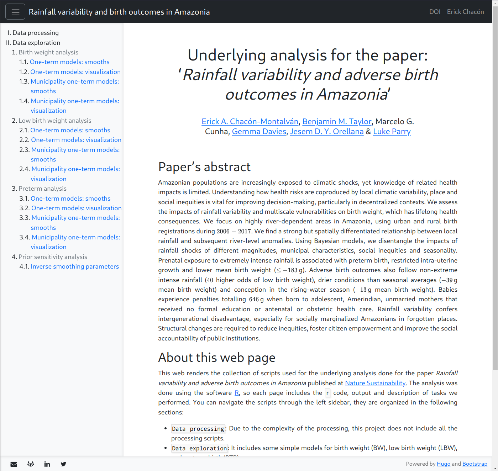

# Scholar-docs

## About

[Hugo](https://gohugo.io/) theme using [Bootstrap 5](https://getbootstrap.com/)
to show documentation.

## Features

- It creates a expandable sidebar using all the files inside the `content`
  folder. This way you can easily navigate all the pages of your
  project. Each folder should contain an `_index.html` file with a `title` on
  the `yaml` section.
- You can remove the sidebar setting up the parameter `sidebar = false` in the
  `config.toml` file.
- The `_index.html` or `_index.rm` main file of the webpage can contain a list
  of authors and webpages to be shown in the webpage.
- It includes a sticky header. You can define the desired links into the
  header. These elements should be defined in `[menu.main]` on the
  `config.toml` file.
- It includes a sticky footer. You can use social media links on the footer
  defining `[params.social]` on the `config.toml` file. The icons are used from
  `fontawesome`.

## Examples

Check the `config-example.toml` to define the desired attributes.
